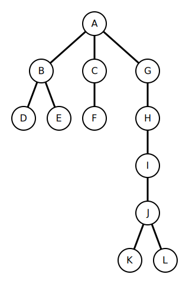

# Easy Tree Visualization Library


The goal of this mini-project is to provide an easy, customizable way to create visualizations of tree structures, without use of `networkx` or similar. <br>


## What this library is
A way to parse a tree in **adjacency dictionary**, or list format and visualize it with a `.svg` file.
It supports various objects as node labels, with easily overridable way to include any object data representable as string as node label. This was done mainly with allowing easy visualization of MCTS search trees in mind. It also allows easy sorting of the nodes, by id, it's properties or object's properties. Id can also be an object, e.g. MCTS State custom timestamp class.

## What it is not
This is **not** a library for storing, modifying, or parsing trees -- let alone graphs.

## Usage
Example use of the library:
```python
    tree_data = {
        "A": ["B", "C", "G"],
        "B": ["D", "E"],
        "C": ["F"],
        "D": [], "E": [], "F": [], 
        "G": ["H"],
        "H": ["I"],
        "I": ["J"],
        "J": ["K", "L"],
        "K": [], "L": []
    }
    tree = Tree.from_dict(tree_data)
    draw_tree(tree, "tree.svg")
```
Result: <br>
 <br>
Please visit `examples/` directory for a few more examples, including customization, node ordering and visualizing different objects.

## Customization
Available parameters include:
```
    NODE_RADIUS
    FONT_SIZE
    EDGE_STROKE - color of lines between nodes
    EDGE_STROKE_WIDTH - width of line between nodes
    FILL_NODE - node fill color, per svgwrite.Drawing
    STROKE_NODE - color of node border
    STROKE_NODE_WIDTH - width of node border
    X_SPACING - minimum spacing between nodes in the same row
    Y_SPACING - minimum spacing between nodes in different rows
    MARGIN - margin around entire tree, as the image is cut to width+margin by height+margin
    TEXT_OFFSET - offset from middle of the node
```

## Performance
While not specifically optimized for performance, the library is capable of handling large trees (e.g., >5000 nodes) in a few seconds.
